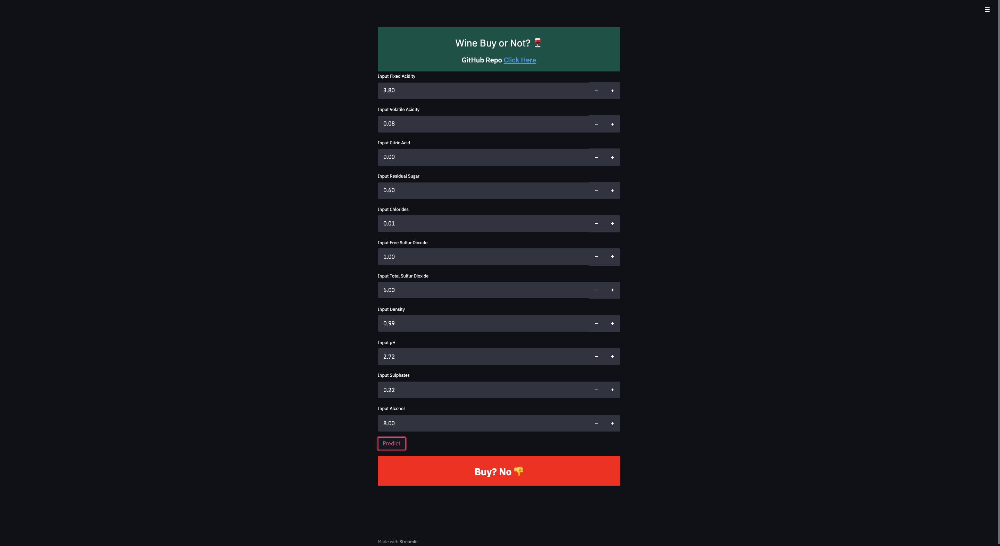

# Wine Buy Or Not? :wine_glass:

# The Goal :pushpin:
The goal of this project was to indicate to users if a bottle of wine should be bought based on the wine's makeup.

# About the Data :card_file_box:
Data was sources:
- [Source One](https://online.stat.psu.edu/stat508/lesson/analysis-wine-quality-data)
- [Source Two](https://www.kaggle.com/swetash/beginners-friendly-comparison-of-classifiers/data)

# About the Project :open_file_folder:
- Classification problem.
- Handled imbalance data using Random Under Sampling and SMOTE.
- Data visualization conducted using pandas, seaborn and matplotlib.
- Data split into train/validation and test.
- Gridsearch CV used to find the best hyper-parameters a model.
- Stepwise Regression for model selection
- Median used for NANs
- Algorithms used (Decision Tree, SVM, KNN, Logistic Regression	and Random Forest.)
- ROC AUC and Accuracy calculated.
- Streamlit for UI

# Data Modeling Recap :chart_with_upwards_trend:
## Training Data (Model Selecting/Hyperparameter Tuning)
| Algorithm | Accuracy |
| --- | ----------- |
| Decision Tree	 | 0.718237 |
| SVM | 0.746600 |
| KNN | 0.644159 |
| Logistic Regression | 0.737460 |
| Random Forest	 | 0.766761 |

## Testing Data
|  | Accuracy | ROC AUC|
| --- | ----------- |----- |
| Basic Testing | 0.770384 | 0.836461 |
| Basic Testing - SMOTE | 0.764761 | 0.835178 |
| Basic Testing - RUS | 0.749766 | 0.835178 |
| SWR Training | 0.778819 | 0.832239 |
| SWR Training - SMOTE | 0.755389 | 0.829311 |
| SWR Training - RUS | 0.743205 | 0.828811 |

# Stream lit :computer:
The model was wrapped in streamlit to create an easy to use interface.

<b> How to run application? </b> 

1. Clone GitHub
2. Run Notebook (This is important as all files you will need for Streamlit are generated through the notebook.)
3. In your IDE, run the command "streamlit run app.py" 